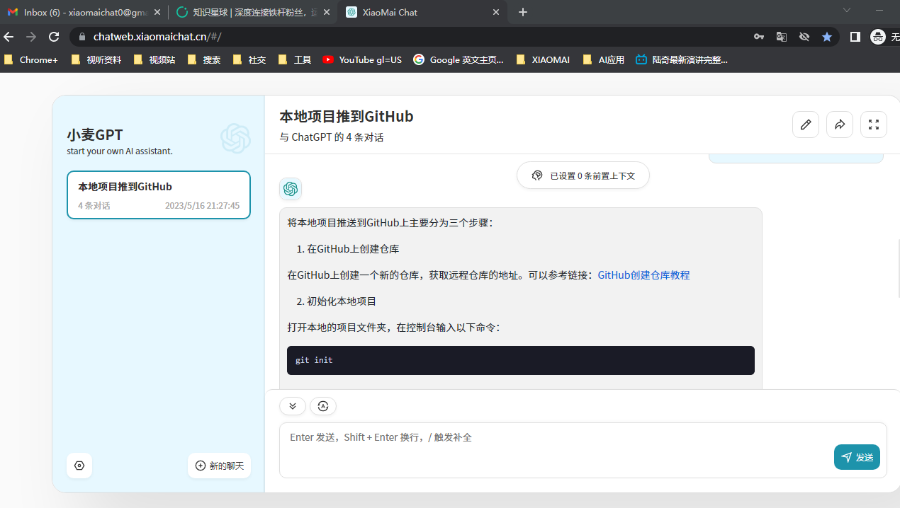

##  手动搭建chatgpt聊天工具

# 一、拉取代码(此处选用的是Yidadaa大佬的开源项目)
https://github.com/Yidadaa/ChatGPT-Next-Web  
fork过来便于改造：https://github.com/xiangyoulu/ChatGPT-Next-Web  

然后尝试本地启动项目，可以加一些自己的小功能。暂时随便加了一个百度统计(后台查看网站访问情况)和打赏功能。  

# 二、搭建
1.进入Vercel官网，https://vercel.com，选择 Continue with GitHub  
2.登录进去后点击add new -> project  
3.选择刚才fork的项目  
4.框架、构建设置等内容Vercel已经帮我们选好了，我们只需要配置一下环境变量就ok啦，点击Environment Variables ，  
将自己的OpenAI API Key填进来，同时，也可设置网站的访问码，防止一些恶意访问。  
参数1： OPENAI_API_KEY  --自己openai账号申请的key，访问gpt接口需要该key作为权限。  
参数2：CODE    --自定义密码。  
5.然后点击 Deploy进行部署  
6.部署完成后，将自己的域名绑定过来，以后通过自己的域名访问就好啦  
https://chatweb.xiaomaichat.cn/  

# 三、测试
1.直接聊天会提示错误  
2.设置-输入密码-填写参数2设置的CODE  
3.回到聊天窗口能正常对话即打工告成  
